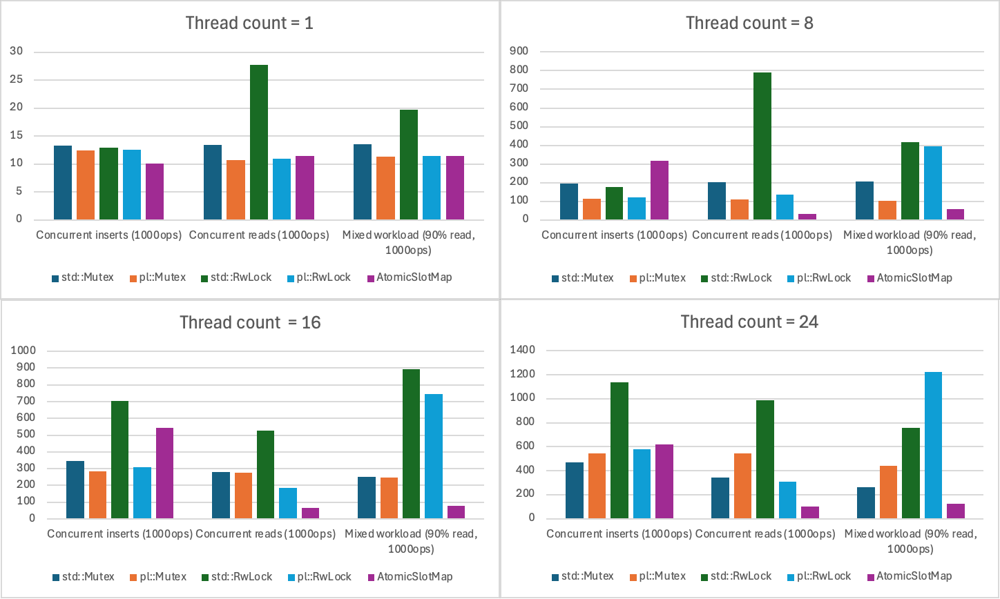
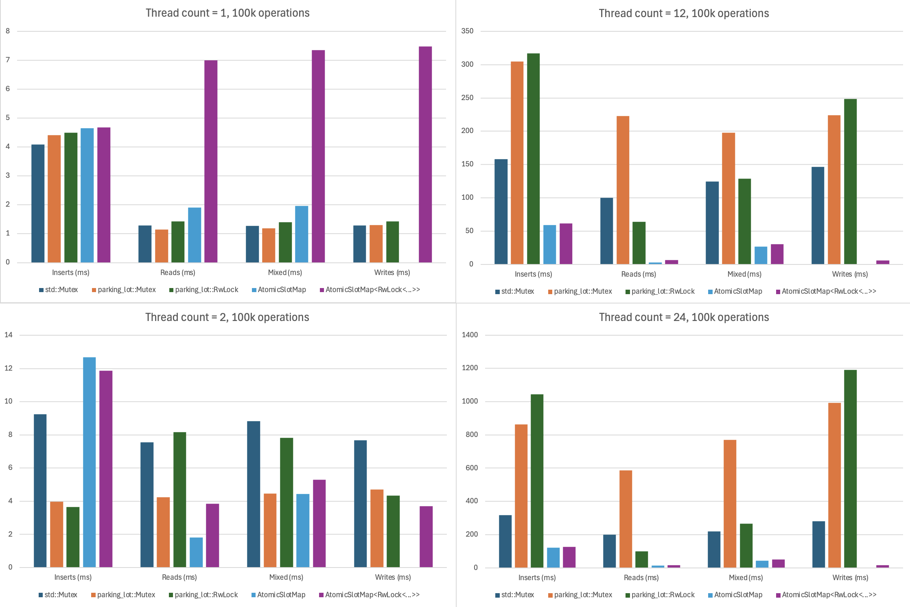

# atomic_slotmap

This library is an extension to the [slotmap](https://crates.io/crates/slotmap) crate, adding an atomic slotmap which can be modified without a mutable reference, in a lockfree[^1] way.

The API of this crate is mostly similar to the slotmaps from the slotmap crate. An `get_owning` operation which isn't tied to the slotmap is added. The lock-free-ness of this slotmap makes it impossible to bulk read / modify its contents. This means that it is impossible to clear, iterate, clone or debug the slotmap without an exclusive mutable reference.

This structure outperforms Mutex and RwLock wraps of the regular SlotMap in most of the multithreaded scenarios:

This test was performed on an M2 macbook air with 8 cores.

This test was perfoemd on an Intel i5-12400KF

[^1]: Threads might spinloop for very short amounts of time when an atomic vector allocated a new chunk of memory (this code path is hard to hit even after a long time of fuzzing)